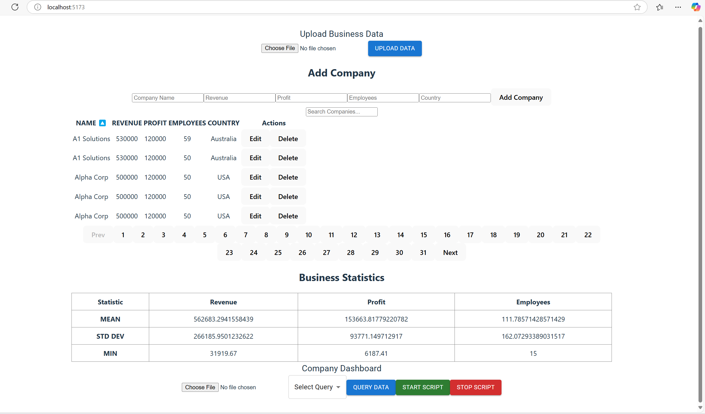
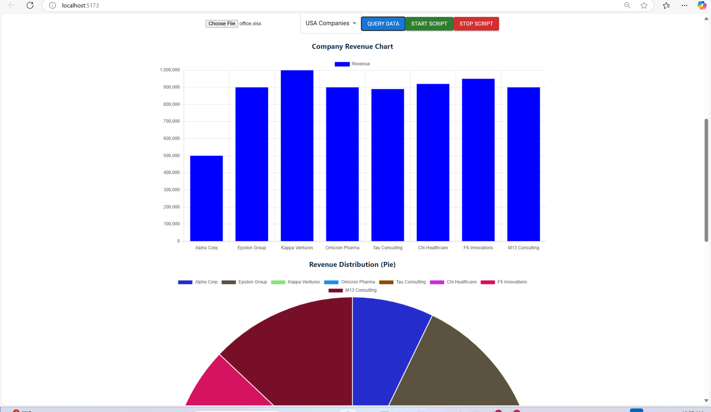

# 📊 Dashboard: React, Django, MySQL – Upload & Visualize Companies Data

## 📌 Project Overview
This full-stack dashboard allows users to upload Excel files containing company data, store them in a MySQL database, and visualize insights through interactive charts. The frontend is built with **React**, while the backend is powered by **Django & Django REST Framework (DRF)**.

---

## 🚀 Features
✅ Upload Excel/CSV files to store company details  
✅ Store company data (name, revenue, employees, profit, etc.) in MySQL  
✅ API for fetching and filtering companies  
✅ Generate **bar, pie, and scatter charts** based on filters  
✅ Secure authentication & authorization  
✅ Responsive React UI  

---

## 🛠️ Tech Stack
### **Frontend**
- React
- Material-UI (MUI)
- Axios (API requests)
- Recharts (data visualization)

### **Backend**
- Django & Django REST Framework
- Pandas (data processing)
- Charts.js (chart generation)
- MySQL (database)

---

## ⚙️ Installation Guide

### 1️⃣ Clone the Repository
```sh
git clone https://github.com/your-username/your-repo.git
cd your-repo
```

### 2️⃣ Backend Setup (Django + MySQL)
#### Create a Virtual Environment
```sh
python -m venv venv
source venv/bin/activate  # On Windows: venv\Scripts\activate
```

#### Install Dependencies
```sh
pip install -r requirements.txt
```

#### Configure Database (MySQL)
Edit **settings.py**:
```python
DATABASES = {
    'default': {
        'ENGINE': 'django.db.backends.mysql',
        'NAME': 'your_database',
        'USER': 'your_user',
        'PASSWORD': 'your_password',
        'HOST': 'localhost',
        'PORT': '3306',
    }
}
```

#### Run Migrations
```sh
python manage.py makemigrations
python manage.py migrate
```

#### Start Django Server
```sh
python manage.py runserver
```

### 3️⃣ Frontend Setup (React)
#### Install Dependencies
```sh
cd frontend
npm install
```

#### Run React App
```sh
npm start
```

---

## 🔗 API Endpoints
| Method | Endpoint | Description |
|--------|---------|-------------|
| **POST** | `/api/upload/` | Upload an Excel file |
| **GET** | `/api/companies/` | List all companies |
| **DELETE** | `/api/delete-company/<id>/` | Delete a company |
| **PUT** | `/api/update-company/<id>/` | Update company details |
| **GET** | `/api/generate-chart/<chart_type>/` | Get chart data |

---

## 📊 Usage
1️⃣ Upload an Excel file with company details  
2️⃣ View stored company data via API or frontend 


3️⃣ Filter and generate charts for revenue, employees, etc.  


4️⃣ Update or delete company records as needed  

---

## 🏗️ Future Improvements
🔹 Role-based authentication (Admin/User)  
🔹 Export filtered data as CSV/Excel  
🔹 More chart types & real-time updates  

---

## 🤝 Contributing
1. **Fork** the repo  
2. **Create a new branch** (`feature-xyz`)  
3. **Commit your changes**  
4. **Open a pull request** 🚀  

---

## 📜 License
This project is licensed under the **MIT License**.

---

## 💡 Have Questions?
Feel free to **open an issue** or reach out! 🚀

